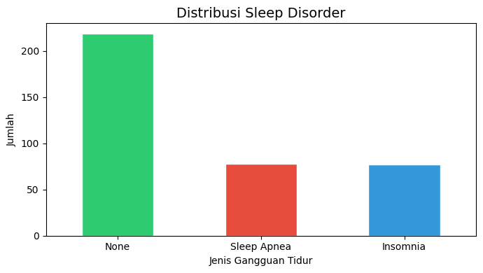
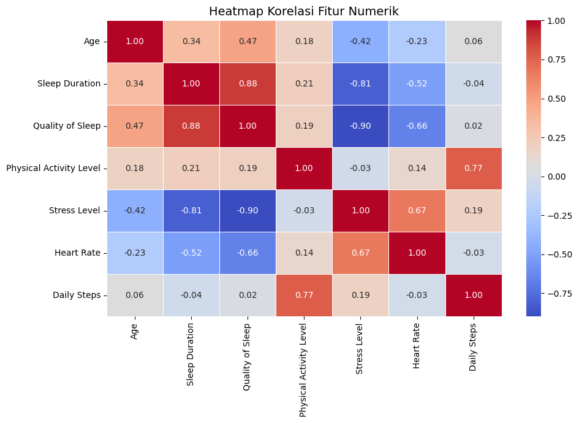
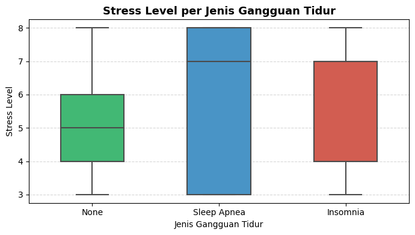
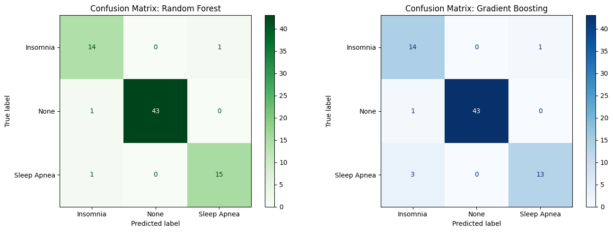
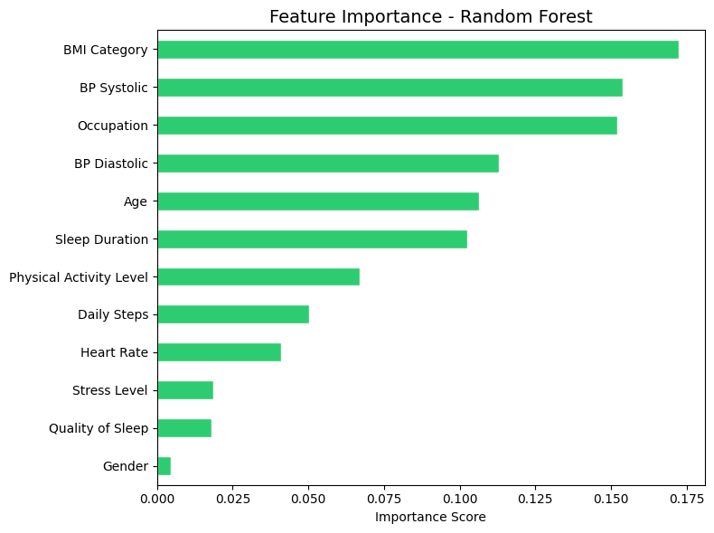
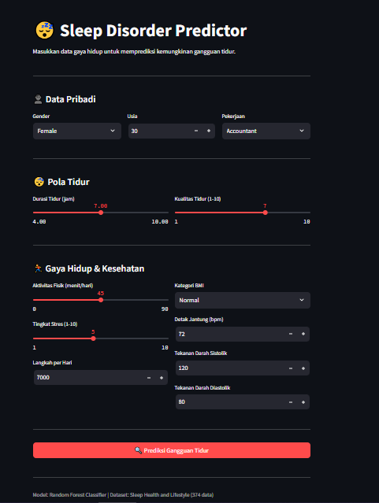

# 😴 Prediksi Gangguan Tidur Berdasarkan Gaya Hidup
<p align="center">
  
</p>

## 📌 Project Overview
Proyek ini bertujuan memprediksi jenis gangguan tidur seseorang (None / Insomnia / Sleep Apnea) berdasarkan data gaya hidup dan kondisi kesehatan menggunakan algoritma machine learning dengan metodologi **CRISP-DM**.

🔗 **Live Demo:** [Link Live Demo](https://huggingface.co/spaces/FauzanYaafi123/SleepHealth)
📓 **Notebook:** [Link Notebook](https://colab.research.google.com/drive/1eBac_9o-Z-2tAuP9z_bW8S1bnw86OpAo?usp=sharing)

---

## 👥 Tim
| Nama | NIM |
|------|-----|
| [Fauzan Yaafi] | [2330511068] |
| [M Syaqiran NF] | [2330511091] |

---

## 📂 Struktur Repositori
```
├── app.py                              # Aplikasi Streamlit
├── sleep_health_classification.ipynb  # Notebook CRISP-DM
├── sleep_model.pkl                     # Model hasil training
├── requirements.txt                    # Dependency
├── images/                             # Folder screenshot hasil
└── README.md                           # Laporan proyek
```

---

## 1. Business Understanding

### Latar Belakang
Gangguan tidur seperti insomnia dan sleep apnea semakin umum di masyarakat modern. Kondisi ini berkaitan erat dengan gaya hidup seperti tingkat stres, aktivitas fisik, dan pola tidur. Deteksi dini dapat membantu seseorang segera mencari penanganan yang tepat sebelum berdampak lebih serius pada kesehatan.

### Problem Statement
> *Dapatkah kita memprediksi jenis gangguan tidur seseorang (None, Insomnia, Sleep Apnea) berdasarkan data gaya hidup dan kondisi kesehatan menggunakan algoritma machine learning?*

### Goals
- Membangun model klasifikasi untuk memprediksi jenis gangguan tidur
- Mengidentifikasi faktor gaya hidup yang paling berpengaruh terhadap gangguan tidur
- Men-deploy model sebagai aplikasi web interaktif

### Solution Statement
- **Model Utama:** Random Forest Classifier
- **Model Pembanding:** Gradient Boosting Classifier
- **Metrik Evaluasi:** Accuracy, Precision, Recall, F1-Score

---

## 2. Data Understanding

### Sumber Data
- **Dataset:** [Sleep Health and Lifestyle Dataset - Kaggle](https://www.kaggle.com/datasets/uom190346a/sleep-health-and-lifestyle-dataset)
- **Jumlah data:** 374 baris
- **Jumlah fitur:** 13 kolom

### Deskripsi Fitur
| Fitur | Tipe | Deskripsi |
|-------|------|-----------|
| `Gender` | kategorikal | Jenis kelamin |
| `Age` | numerik | Usia dalam tahun |
| `Occupation` | kategorikal | Jenis pekerjaan |
| `Sleep Duration` | numerik | Durasi tidur per malam (jam) |
| `Quality of Sleep` | numerik | Kualitas tidur skala 1-10 |
| `Physical Activity Level` | numerik | Durasi aktivitas fisik (menit/hari) |
| `Stress Level` | numerik | Tingkat stres skala 1-10 |
| `BMI Category` | kategorikal | Kategori BMI |
| `Blood Pressure` | string | Tekanan darah (sistolik/diastolik) |
| `Heart Rate` | numerik | Detak jantung (bpm) |
| `Daily Steps` | numerik | Jumlah langkah per hari |
| `Sleep Disorder` | kategorikal | **Target** — None / Insomnia / Sleep Apnea |

### EDA Findings
- Distribusi kelas target relatif seimbang antara None, Insomnia, dan Sleep Apnea
- Stres level tinggi cenderung berkorelasi dengan gangguan tidur
- Kualitas tidur dan durasi tidur berkorelasi positif

<p align="center">
  
  <br>
  <em>Gambar 1. Distribusi Label Sleep Disorder</em>
</p>

<p align="center">
  
  <br>
  <em>Gambar 2. Heatmap Korelasi Fitur Numerik</em>
</p>

<p align="center">
  
  <br>
  <em>Gambar 3. Stress Level per Jenis Gangguan Tidur</em>
</p>

---

## 3. Data Preparation

1. **Drop kolom tidak relevan:** `Person ID`
2. **Handle missing values:** NaN pada `Sleep Disorder` diisi dengan `None` (tidak ada gangguan)
3. **Feature engineering:** Kolom `Blood Pressure` dipecah menjadi `BP Systolic` dan `BP Diastolic`

```python
df_clean[['BP Systolic', 'BP Diastolic']] = df_clean['Blood Pressure'].str.split('/', expand=True).astype(int)
```

4. **Encoding:** Kolom kategorikal di-encode menggunakan LabelEncoder

```python
le = LabelEncoder()
for col in ['Gender', 'Occupation', 'BMI Category']:
    df_clean[col] = le.fit_transform(df_clean[col])
```

5. **Split data:** 80% training, 20% testing dengan stratified split

```python
X_train, X_test, y_train, y_test = train_test_split(
    X, y, test_size=0.2, random_state=42, stratify=y
)
```

---

## 4. Modeling

### Model 1: Random Forest Classifier

```python
rf_model = RandomForestClassifier(
    n_estimators=100,
    max_depth=10,
    random_state=42,
    n_jobs=-1
)
rf_model.fit(X_train, y_train)
```

### Model 2: Gradient Boosting Classifier

```python
gb_model = GradientBoostingClassifier(
    n_estimators=100,
    max_depth=5,
    random_state=42
)
gb_model.fit(X_train, y_train)
```

---

## 5. Evaluation

### Hasil Perbandingan Model
| Model | Accuracy | Precision (avg) | Recall (avg) | F1-Score (avg) |
|-------|----------|-----------------|--------------|----------------|
| Random Forest | **96.00%** | 0.94 | 0.95 | 0.94 |
| Gradient Boosting | 93.33% | 0.90 | 0.91 | 0.90 |

Model **Random Forest** dipilih sebagai model terbaik dengan akurasi **96%** pada data uji.

### Classification Report: Random Forest
| Kelas | Precision | Recall | F1-Score | Support |
|-------|-----------|--------|----------|---------|
| Insomnia | 0.88 | 0.93 | 0.90 | 15 |
| None | 1.00 | 0.98 | 0.99 | 44 |
| Sleep Apnea | 0.94 | 0.94 | 0.94 | 16 |
| **Weighted Avg** | **0.96** | **0.96** | **0.96** | **75** |

### Confusion Matrix

<p align="center">
  
  <br>
  <em>Gambar 4. Confusion Matrix Random Forest vs Gradient Boosting</em>
</p>

### Feature Importance

<p align="center">
  
  <br>
  <em>Gambar 5. Feature Importance - Random Forest</em>
</p>

Fitur paling berpengaruh terhadap prediksi gangguan tidur:
1. [BMI Category]
2. [BP Systolic]
3. [Occupation]

### Cross-Validation (5-Fold)

```
CV Scores : [0.680, 0.693, 0.960, 0.533, 0.838]
Mean Accuracy : 0.7409 ± 0.1459
```


## 6. Deployment

Model di-deploy di **Hugging Face Spaces**.

### Tampilan Aplikasi

<p align="center">
  
  <br>
  <em>Gambar 6. Tampilan Sleep Disorder Predictor</em>
</p>

---

## ⚠️ Disclaimer
Hasil prediksi aplikasi ini **bukan merupakan diagnosis medis**. Selalu konsultasikan kondisi kesehatan Anda dengan tenaga medis profesional.

---
